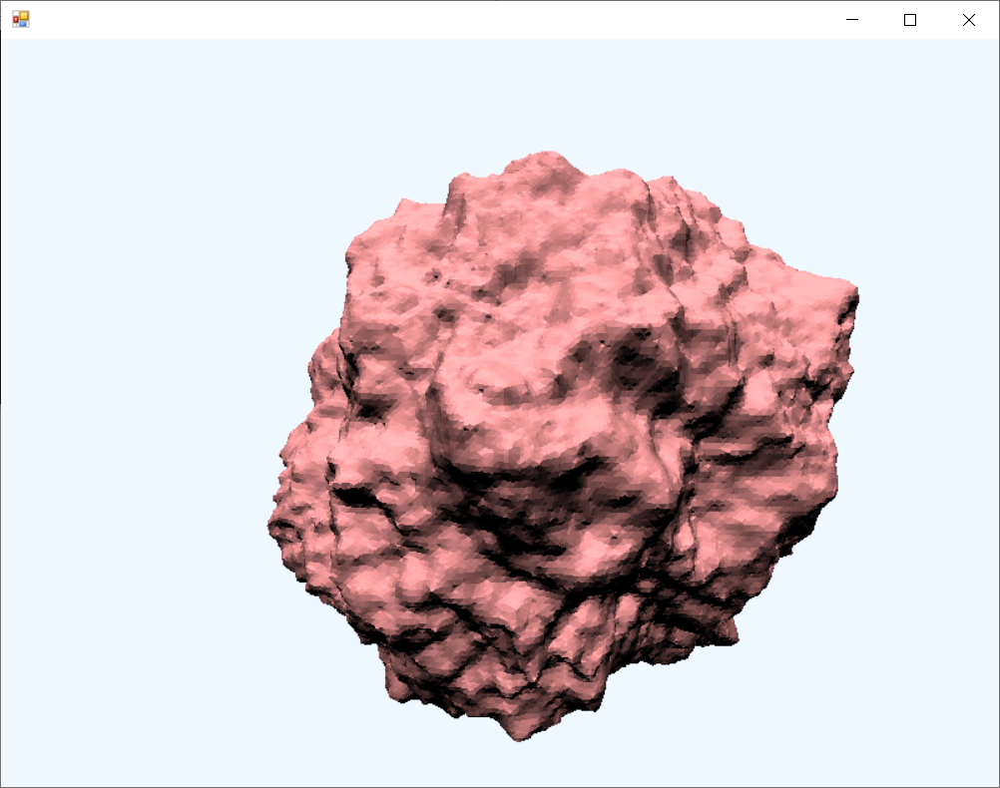

# RandomRock

Playground for generating terrains with Perlin noise.

Ultimate goal is to generate terrains (planets, meteorites, etc.) suitable for space games. Currently the random function and a basic mesh generator is working. 

## Useful links

* http://accidentalnoise.sourceforge.net/minecraftworlds.html
* http://www.boristhebrave.com/2018/04/15/dual-contouring-tutorial/
